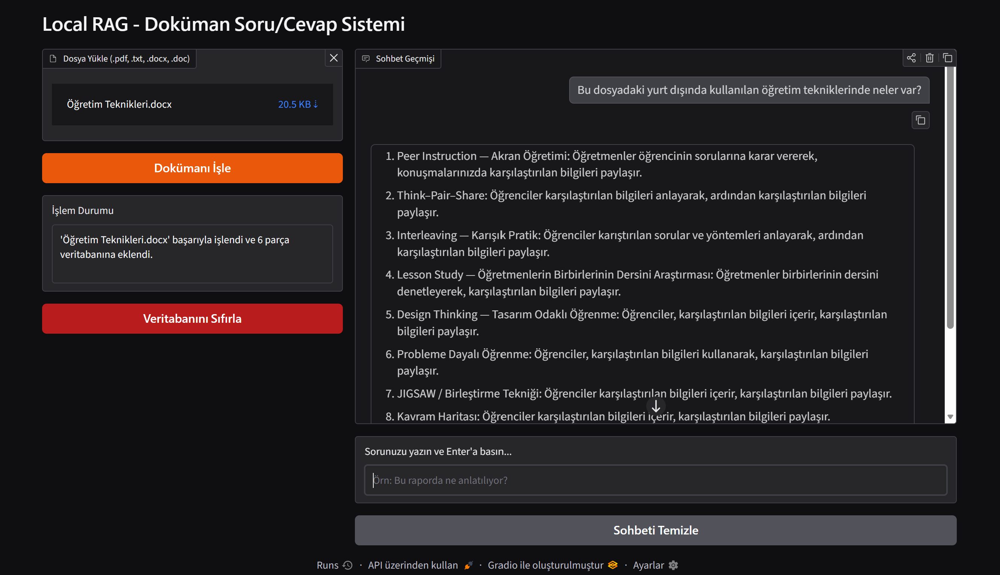

# Local RAG - Çevrimdışı Doküman Soru/Cevap Sistemi

Bu proje, **Microsoft Foundry Local SDK** altyapısı kullanılarak geliştirilmiş, tamamen yerel (offline) ve özel veri gizliliğini koruyan bir **RAG (Retrieval-Augmented Generation)** uygulamasıdır. 

Kullanıcılar PDF, DOCX, DOC ve TXT formatındaki dokümanlarını sisteme yükleyebilir, vektör veritabanı üzerinden doküman içeriğiyle ilgili sorular sorabilir ve tamamen internet bağlantısına ihtiyaç duymadan doğru yanıtlar alabilirler.

---

## Öne Çıkan Özellikler

- **%100 Yerel ve Gizli:** Tüm modeller ve veritabanı bilgisayarınızda local olarak çalışır. Dış sunuculara veya internete veri gönderilmez.
- **Gelişmiş RAG Mimarisi:** Dokümanlar anlamlı parçalara bölünür, vektörleştirilir ve kosinüs benzerliği ile en alakalı kısımlar modele sunulur.
- **Çoklu Format Desteği:** `.pdf`, `.docx`, `.doc` ve `.txt` uzantılı dosyaları işleme yeteneği.
- **Halüsinasyon Engelleme:** Model, yalnızca yüklenen dokümanlardaki bilgilere dayanarak yanıt verir; dokümanda olmayan bilgiler için halüsinasyon üretmez.
- **Kullanıcı Dostu Arayüz:** Gradio tabanlı modern ve dinamik web arayüzü.

---

## Kullanılan Teknolojiler ve Modeller

| Bileşen | Teknoloji / Model | Açıklama |
| :--- | :--- | :--- |
| **Orchestration / SDK** | `Foundry Local SDK` | Yerel LLM ve embedding modellerini yönetir. |
| **Chat Model (LLM)** | `phi-3.5-mini` | Yanıt üretimi sağlayan dil modeli. |
| **Embedding Model** | `qwen3-embedding-0.6b` | Metin parçalarını vektörlere dönüştüren model. |
| **Vector Storage** | `SQLite` | Metin ve vektör verilerini yerelde saklar. |
| **Arayüz (UI)** | `Gradio` | Kullanıcı etkileşimi sağlayan web arayüzü. |
| **LLM İstemcisi** | `OpenAI Python SDK` | Localhost üzerindeki API ile iletişim kurar. |

---

## Proje Mimarisi ve Klasör Yapısı

MicrosoftRagProjesi/
├── database/
│   └── db_manager.py       # SQLite veritabanı işlemleri ve Kosinüs Benzerliği araması
├── models/
│   └── embedding.py        # Metin vektörleştirme (Embedding) işlevleri
├── utils/
│   └── file_loader.py      # Dosya okuma (PDF, DOCX, TXT) ve metin parçalama (Chunking)
├── app.py                  # Gradio arayüzü ve RAG pipeline mantığı
├── main.py                 # Foundry SDK başlatıcı ve ana giriş noktası
├── requirements.txt        # Gerekli Python kütüphaneleri
└── README.md               # Proje dokümantasyonu

---

## Kurulum ve Çalıştırma

### 1. Gereksinimler
- Python 3.10 veya üzeri
- Microsoft Foundry Local CLI / SDK ortamı

### 2. Kütüphanelerin Yüklenmesi
Sanal ortamınızı aktifleştirdikten sonra gerekli bağımlılıkları yükleyin:

```bash
pip install -r requirements.txt
```

---


